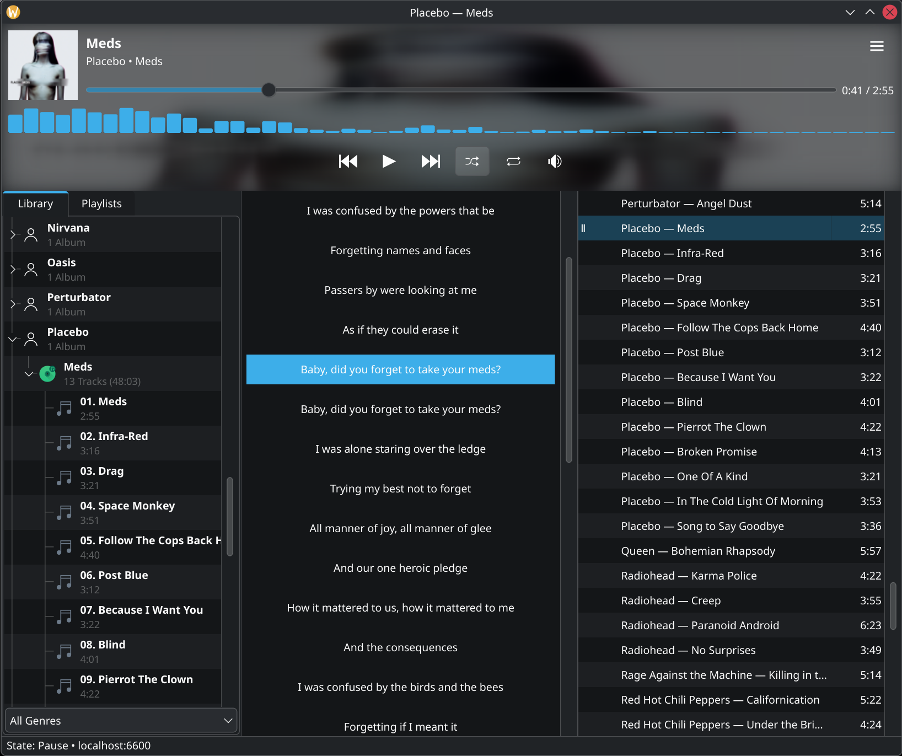

# Crystal MPD

A desktop [MPD](https://www.musicpd.org/) client written in [Crystal](https://crystal-lang.org/) using [Qt6](https://github.com/djberg96/crystal-qt6) shard.

## Screenshots



## Features

- Playback controls for play, pause, previous, and next
- Interactive progress slider with elapsed and total time display
- Shuffle and repeat toggles
- Live track, artist, and album metadata updates
- Window title updates to reflect the current song
- Album art loading from MPD when available
- Queue view with current-track state icons
- Double-click a queue row to start playback instantly
- Database browser grouped as artist → album → songs
- Drag and drop songs, albums, or artists from the database into the queue
- Drop-position queue insertion for fast playlist building
- Connection settings dialog for MPD host and port
- Settings persisted in the user config directory

## Requirements

- Crystal >= 1.19.1
- Qt6 Widgets development packages
  - Arch: `pacman -S qt6-base`
  - Ubuntu: `apt-get install qt6-base-dev`
  - macOS: `brew install qt`
- A running MPD server

## Installation

```sh
git clone https://github.com/mamantoha/mpd-qt6
cd mpd-qt6
shards install
shards build --release
./bin/mpd-qt6
```

## Dependencies

| Shard | Purpose |
|---|---|
| [djberg96/crystal-qt6](https://github.com/djberg96/crystal-qt6) | Qt6 bindings for Crystal |
| [mamantoha/crystal_mpd](https://github.com/mamantoha/crystal_mpd) | MPD protocol client |

## Platform support

Tested on Linux and macOS with Qt6. Windows are untested.

## Architecture notes

- One MPD client handles commands and status reads
- A separate callback-enabled MPD listener pushes live updates from the server
- UI updates are marshalled safely onto the Qt main thread through a signal-style bridge
- Playback and playlist controls are built with Qt widgets such as push buttons, sliders, and table views

## License

MIT
